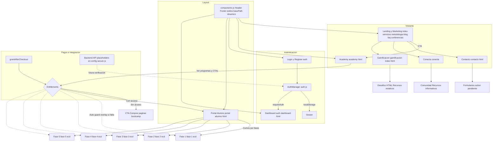
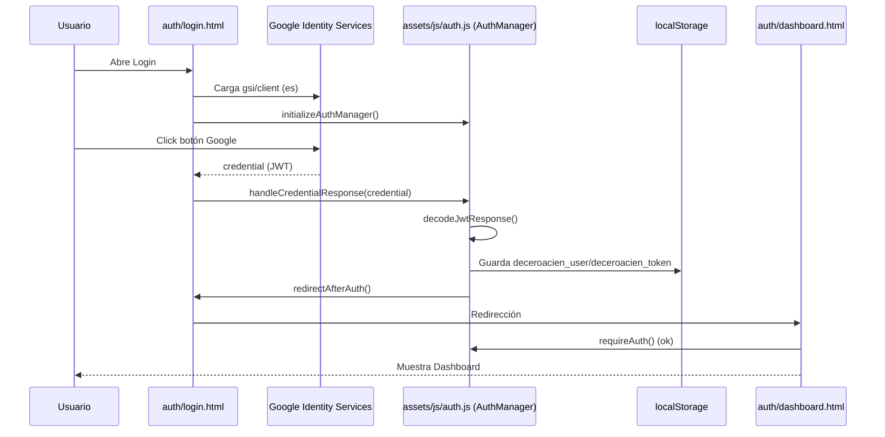
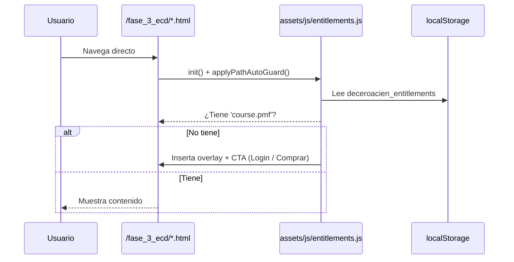

# Diagrama de Flujo de la Plataforma DE CERO A CIEN

Este documento resume el flujo actual de la plataforma y marca el estado de implementación de cada módulo: 
- [✅] Completado 100%
- [🟡] Parcial
- [⛔] Faltante

## Visión general

## Estado de madurez por módulo
- UI unificada (Header/Footer, estilos, rutas): ✅ Completo (`assets/js/components.js`, `assets/styles/*`).
- Autenticación cliente (GIS, formularios, sesión local): 🟡 Parcial. No hay verificación de token ni refresh contra backend. `auth.js` simula login/registro.
- Entitlements y gating de contenidos: ✅ Completo en cliente. Incluye `?grant=` y auto-guard por carpeta.
- Pagos e integración real: ⛔ Faltante. Solo stub `paymentEntitlements.grantAfterCheckout`.
- Portal del Alumno y herramientas por fase: 🟡 Parcial. Estructura completa, contenido funcional depende de cada herramienta HTML.
- Formularios de contacto/consultoría: 🟡 Parcial. Muchos usan `action="#"`; falta envío a backend/servicio.
- Comunidad Conecta y Gamificación: 🟡 Parcial/Informativo. Páginas existen; falta wiring a funcionalidades dinámicas.

## Notas operativas para entender el “cómo”
- Carga de scripts recomendada: incluir siempre `assets/js/components.js` y, si hay acceso protegido, `assets/js/auth.js` y/o `assets/js/entitlements.js`.
- `components.js` detecta `basePath` según el `src` del script para que los enlaces funcionen dentro de subcarpetas (por ejemplo en `/auth/` o `/conecta/`).
- Protección por ruta: acceder directo a `/fase_*_ecd/` sin entitlement muestra un overlay con CTA; no destruye el DOM, se puede inspeccionar.
- Simular compra: añadir `?grant=course.pmv` a la URL o ejecutar `paymentEntitlements.grantAfterCheckout({ items: ['course.pmv'] })` en consola.
- GIS: `config-secure.js` expone `window.PublicAuthConfig` y `googleClientId` (construido en runtime). `auth/*.html` carga `https://accounts.google.com/gsi/client?hl=es`.

## Principales archivos de referencia
- Layout y navegación: `assets/js/components.js`, `assets/templates/base.html`.
- Autenticación: `assets/js/config-secure.js`, `assets/js/auth.js`, `auth/*.html`.
- Entitlements: `assets/js/entitlements.js`, `portal-alumno.html`, `academy.html`.
- Marketing: `index.html`, `servicios.html`, `metodologia.html`, `blog.html`.
- Comunidad y juegos: `conecta/*.html`, `gamificacion/`.

## Claves y datos en el navegador
- Sesión/Auth (localStorage):
  - `deceroacien_user`: JSON del usuario autenticado (cliente).
  - `deceroacien_token`: token simulado (no validado contra backend).
  - `deceroacien_session`: flag de persistencia (remember-me).
- Entitlements (localStorage):
  - `deceroacien_entitlements`: array de strings, ej. `['course.pmv','course.pmf']`.
  - `deceroacien_entitlements_updated`: timestamp para broadcast entre pestañas.

## Diagramas de secuencia clave

### Login con Google y carga de Dashboard

### Acceso a herramienta protegida sin entitlement

## Leyenda / Cómo leer el diagrama
- Rectángulos: páginas HTML o módulos principales.
- Rombo (Mermaid `{}`): lógica condicional (p.ej., entitlements).
- Líneas punteadas: acciones automáticas (auto-guard, overlays).
- Emoji de estado:
  - ✅ Implementado y operativo en cliente.
  - 🟡 Implementado parcialmente o con stubs.
  - ⛔ No implementado en este repo (requiere backend/servicio externo).

## Siguientes pasos sugeridos (no bloqueantes)
- Backend mínimo para auth real: verificar token de Google, emitir JWT propio y refresh.
- Webhook/return de checkout para llamar `grantAfterCheckout()` con los productos comprados.
- Formularios: integrar servicio (p.ej. Formspark/Netlify/Cloudflare Workers) o API propia.
- Progreso en Portal: persistir estados de herramientas en localStorage y/o backend.
